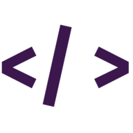
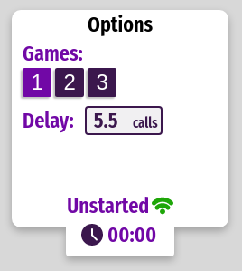

<!--
*** Readme template used: Best-README-Template
*** https://github.com/othneildrew/Best-README-Template
-->
[![Contributors][contributors-shield]][contributors-url]
[![Issues][issues-shield]][issues-url]
[![MIT License][license-shield]][license-url]
[![LinkedIn][linkedin-shield]][linkedin-url]

<!-- PROJECT LOGO -->
 

  

  <h3 align="center">LoL API</h3>

  

    LoL API visualizer with events notifications (Kill, Drake, etc)
     
    <a href="#about-the-project"><strong>Explore the docs »</strong></a>
     
     
    <a href="https://yrodrigo2219.github.io/lolapi/">View Live</a>
    ·
    <a href="https://github.com/yRodrigo2219/lolapi/issues">Report Bug</a>
    ·
    <a href="https://github.com/yRodrigo2219/lolapi/issues">Request Feature</a>
  

<!-- TABLE OF CONTENTS -->

  
Table of Contents

  <ol>
    <li>
      <a href="#about-the-project">About The Project</a>
      <ul>
        <li><a href="#responsiveness">Responsiveness</a></li>
        <li><a href="#built-with">Built With</a></li>
      </ul>
    </li>
    <li><a href="#getting-started">Getting Started</a></li>
    <li><a href="#usage">Usage</a></li>
    <li><a href="#roadmap">Roadmap</a></li>
    <li><a href="#license">License</a></li>
    <li><a href="#contact">Contact</a></li>
    <li><a href="#libs-that-made-it-easy">Libs that made it easy</a></li>
  </ol>

<!-- ABOUT THE PROJECT -->
## About The Project

[![LoL API Screenshot][product-screenshot]](https://yrodrigo2219.github.io/lolapi/)

At the time of its creation, most of the League of Legends APIs didn't show minor leagues games correctly for some reason. It didn't show the itens, it only started working mid game, it was super delayed etc.
 
So, I went looking on where they got their info about the game and found thorough the [lolesport site](https://lolesports.com/) that they used the API to show the game info during game at the site (with delayed info). Seeing that and after discovering this [unofficial docs](https://vickz84259.github.io/lolesports-api-docs/) I started making the webpage.
 
This time, I wanted to test a neat css library, styled-components. And finally try using Redux in something bigger that has lots of colateral effects.

### Responsiveness

[![Betting Calculator Responsive][responsive-screenshot]](https://yrodrigo2219.github.io/lolapi/)

_Shots taken with this [multi-mockup](https://techsini.com/multi-mockup/index.php)_

### Built With

This project was built with:
* [React.js](https://reactjs.org/)
* [Redux](https://redux.js.org/)
* [styled-components](https://styled-components.com/)
* [LoLEsports API](https://vickz84259.github.io/lolesports-api-docs/)

<!-- GETTING STARTED -->
## Getting Started

This project is not meant to be installed locally, but you can check the [Live version](https://yrodrigo2219.github.io/lolapi/).

<!-- USAGE EXAMPLES -->
## Usage

Just open the game and wait for the notifications to popup on screen (you need to be on the webpage).

![Notification Example][notifications-screenshot]

And if needed, you can adjust some of the configs at the game page menu.

* **Games:** Selects the game number
* **Delay:** Select how much delay you want (the lower, the most request errors you get)
* **Game Status:** If the game has already began or is already finished
* **Request Time:** Color represents how fast was the request (Green > Yellow > Red)
* **Game Time:** A guess of the game time (the guess can be wrong if the game was paused/stopped for too long at the beginning)

<!-- ROADMAP -->
## Roadmap

No changes planned.

<!-- LICENSE -->
## License

Distributed under the MIT License. See `LICENSE` for more information.

<!-- CONTACT -->
## Contact

Rodrigo - [@y2219_](https://twitter.com/y2219_) - [Discord](https://discordapp.com/users/308349999719251988)

<!-- ACKNOWLEDGEMENTS -->
## Libs that made it easy
* [Axios](https://axios-http.com/)
* [Date-fns](https://date-fns.org/)
* [Redux Saga](https://redux-saga.js.org/)
* [React Toastify](https://fkhadra.github.io/react-toastify/introduction)
* [React Spinners](https://www.davidhu.io/react-spinners/)

<!-- MARKDOWN LINKS & IMAGES -->
[contributors-shield]: https://img.shields.io/github/contributors/yRodrigo2219/lolapi.svg?style=for-the-badge
[contributors-url]: https://github.com/yRodrigo2219/lolapi/contributors
[issues-shield]: https://img.shields.io/github/issues/yRodrigo2219/lolapi.svg?style=for-the-badge
[issues-url]: https://github.com/othneildrew/yRodrigo2219/lolapi/issues
[license-shield]: https://img.shields.io/github/license/yRodrigo2219/lolapi.svg?style=for-the-badge
[license-url]: https://github.com/yRodrigo2219/lolapi/blob/master/LICENSE
[linkedin-shield]: https://img.shields.io/badge/-LinkedIn-black.svg?style=for-the-badge&logo=linkedin&colorB=555
[linkedin-url]: https://linkedin.com/in/y2219
[product-screenshot]: readme-assets/screenshot.png
[responsive-screenshot]: readme-assets/responsive.png
[notifications-screenshot]: readme-assets/notification.png
[options-screenshot]: readme-assets/options.png